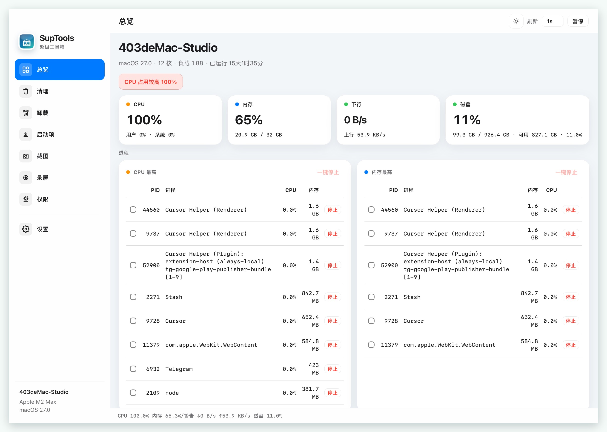
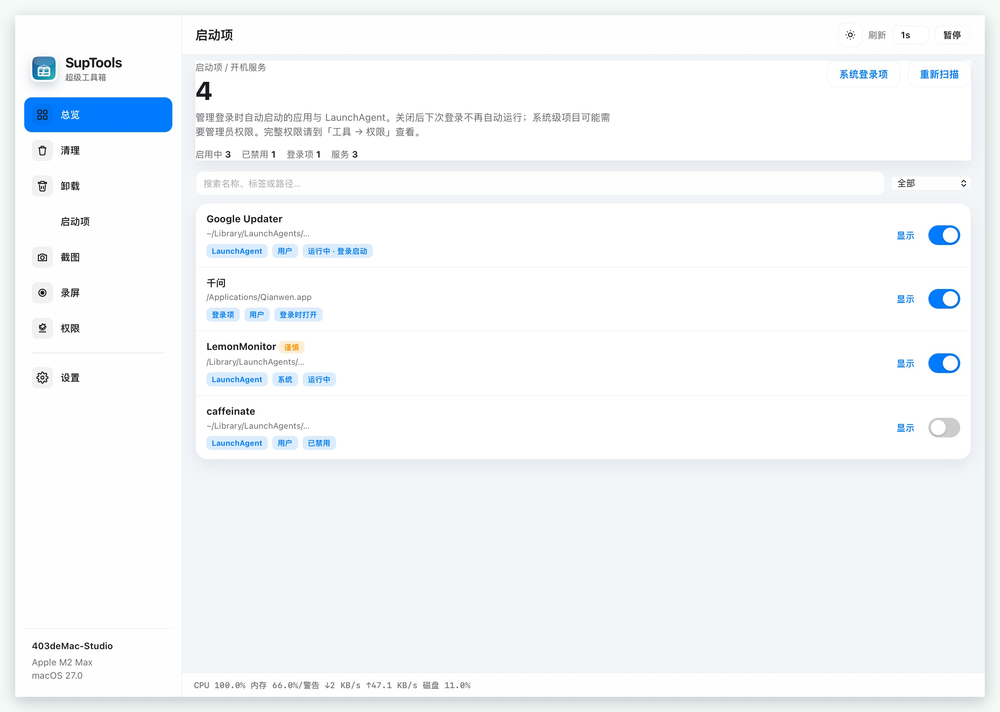

<p align="center">
  
</p>

<h1 align="center">SupTools</h1>

<p align="center">
  <strong>Mac utility suite</strong> — overview, clean, uninstall, login items, capture, permissions
</p>

<p align="center">
  <a href="README.md">中文</a> · <b>English</b>
</p>

<p align="center">
  <a href="https://github.com/linux503/suptools/releases/latest"></a>
  <a href="https://github.com/linux503/suptools/releases"></a>
  <a href="LICENSE"></a>
</p>

<p align="center">
  <a href="https://github.com/linux503/suptools/releases/download/v1.29.0/SupTools-1.29.0-Universal.dmg"><strong>Download Universal DMG</strong></a>
  ·
  <a href="https://linux503.github.io/suptools/">Website</a>
  ·
  <a href="https://github.com/linux503/suptools/releases">All releases</a>
</p>

---

<p align="center">
  
</p>

---

## Features

Everyday Mac maintenance in one window. One Universal installer for Apple Silicon and Intel.

| Module | What it does |
|--------|----------------|
| **Overview** | CPU / memory / network / disk, plus top processes |
| **Clean** | Caches, browsers, developer junk, Trash |
| **Uninstall** | App bundle plus leftover files |
| **Login items** | Login items and LaunchAgents |
| **Capture** | Region / window / full screen, markup and shortcuts |
| **Permissions** | Grant system privacy permissions in one place |

<p align="center">
  
  
  
</p>

## Install

Recommended Universal build:

**[SupTools-1.29.0-Universal.dmg](https://github.com/linux503/suptools/releases/download/v1.29.0/SupTools-1.29.0-Universal.dmg)**

| Package | File |
|---------|------|
| **Universal (recommended)** | `SupTools-*-Universal.dmg` — M-series and Intel |
| Apple Silicon | `SupTools-*-AppleSilicon.dmg` |
| Intel | `SupTools-*-Intel.dmg` |

Open the DMG → drag into Applications → open **Permissions** and follow the prompts. Requires **macOS 13+**.

### From source

```bash
git clone https://github.com/linux503/suptools.git
cd suptools
python3 -m pip install -r requirements.txt
./Scripts/install-to-applications.sh
```

```bash
python3 main.py
```

## Other apps

| App | Role |
|-----|------|
| [Flare Pro](https://github.com/linux503/Flare) | Screenshot and recording |
| [ZipX](https://github.com/linux503/ZipX) | Compress / extract / preview |
| [MacText](https://github.com/linux503/MacText) | Native text editor |
| [FilesDesk](https://github.com/linux503/FilesDesk) | Batch rename |
| [MacFan](https://github.com/linux503/MacFan) | Fan control |

## License

[MIT](LICENSE)
